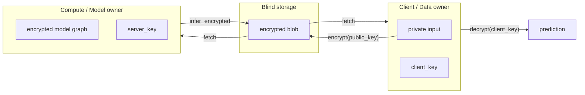

# CERN Quantumacy → quantumacy-rust parity

This document maps the four modules of the upstream
[CERN/Quantumacy](https://github.com/CERN/Quantumacy) research platform to
their Rust counterparts in this workspace. The MVP target is **research
parity**: same demos, same protocol coverage, same end-to-end flow, with
simulation-grade homomorphic encryption.

## Module map

| CERN module | Rust crate(s) | Demo command | Notable deviations from upstream |
|---|---|---|---|
| **QKDSimkit** (BB84/B92/Six-State, P2P + client-server CLIs) | `qkd-core`, `qkd-network` | `cargo run -p qkd-network --example qkd_p2p_demo` <br> `cargo run -p qkd-network --example qkd_client_server_demo` | P2P transport is simulated locally rather than over real TCP; protocol selection via `--protocol` flag matches the upstream switch. |
| **OpenFL fork** (federated learning orchestration) | `fedlearn-core`, `fedlearn-transport` | `cargo run -p fedlearn-transport --example local_platform_demo` <br> `cargo run -p fedlearn-transport --bin server` | Built directly on `tonic`/`tokio` rather than as an OpenFL plugin; FedAvg/DP semantics are reimplemented in Rust, not borrowed from upstream. |
| **dl-models / chestscan** (medical imaging classifiers) | `dl-models` | `cargo run -p dl-models --example chestscan_federated_demo` | Lightweight dense classifier instead of the upstream CNN — Candle/`candle-nn` backed CNN is tracked as post-MVP work. Synthetic dataset substitutes for real DICOM scans. |
| **3-party HE use case** (encrypted inference) | `he-core`, `he-inference` (+ `dl-models` for the model graph) | `cargo run -p he-inference --example three_party_demo` | `he-core` is a CKKS-style simulation, *not* a production CKKS backend (`tfhe-rs` swap is post-MVP). Three-party role separation (client / storage / compute) is enforced at the demo layer; a production split would put each role in its own process. |

## End-to-end demo flow



The same transport that backs `local_platform_demo` is reused for
`chestscan_federated_demo`, so the "client → QKD-keyed AES → FedAvg" path is
shared between the OpenFL-parity and the dl-models-parity demos.

## How to verify locally

```bash
# 1. Sanity check
cargo check --workspace --all-targets
cargo test --workspace
cargo clippy --workspace --all-targets -- -D warnings

# 2. Module-by-module parity
cargo run -p qkd-network          --example qkd_p2p_demo
cargo run -p qkd-network          --example qkd_client_server_demo
cargo run -p fedlearn-transport   --example local_platform_demo -- --clients 4 --rounds 5
cargo run -p dl-models            --example chestscan_federated_demo
cargo run -p he-inference         --example three_party_demo

# 3. Persistent server (mirrors what local_platform_demo does inline)
cargo run -p fedlearn-transport --bin server
```

Every demo prints a deterministic, human-readable summary so the parity claims
above can be checked at a glance.

## Build environments

| Environment | `protoc` source | Notes |
|---|---|---|
| Full env (CI / dev box) | System `protoc` (homebrew, apt) | Set `PROTOC=/path/to/protoc` to override. |
| Constrained env (sandboxes) | Vendored via `protoc-bin-vendored` | No extra install required; build script auto-falls-back. |

## Out of scope (post-MVP)

The following items are intentionally deferred and **must not** be assumed
when integrating the workspace:

- Real HE backend (`tfhe-rs` / production CKKS) replacing `he-core`'s
  simulation.
- TLS / rustls overlay, authn/z, and elimination of raw key material in
  process memory.
- Real TCP/TLS P2P transport replacing the simulated peer-to-peer flow in
  `qkd-network/src/p2p.rs`.
- Candle-backed CNN replacing the dense baseline in `dl-models`.

Track production hardening in [RELEASE_READINESS.md](RELEASE_READINESS.md).
